# My LangSmith Hands-on Practice Log & Experiments 🚀

This repository documents my hands-on practice, experiments, and learning journey with **LangSmith**—LangChain's tracing, debugging, and evaluation platform. Here, I've implemented and traced 5 different exercises, progressing from basic LLM calls to complex agents and parallel LangGraph workflows.

---

## 🛠️ Setup Instructions

### 1. Prerequisites
Ensure you have Python 3.9+ installed on your system.

### 2. Install Dependencies
Install all the required packages using the `requirements.txt` file:
```bash
pip install -r requirements.txt
```

### 3. Environment Configuration
Create a `.env` file in the root directory (or update the existing one) with your credentials:
```env
# Mistral API Key (for LLM calls)
MISTRAL_API_KEY="your_mistral_api_key_here"

# LangSmith Configuration
LANGCHAIN_TRACING_V2=true
LANGCHAIN_ENDPOINT="https://api.smith.langchain.com"
LANGCHAIN_API_KEY="your_langsmith_api_key_here"
LANGSMITH_PROJECT="My First App"
```

---

## 📚 Practice Exercises & Experiments

### 1. Simple LLM Call (`1_simple_llm_call.py`)
This script demonstrates the absolute basics of LangSmith auto-tracing. By simply enabling the environment variables, any LangChain run is automatically sent to LangSmith.

- **Concepts**: Simple prompt, model invocation, output parsing, automatic trace capture, setting project names dynamically.
- **Project Configuration**: Sets `os.environ['LANGSMITH_PROJECT'] = 'Simple LLM App'` to route traces to a specific dashboard project.
- **Run**:
  ```bash
  python3 1_simple_llm_call.py
  ```
- **LangSmith Tracing Visualization**:
  You will see a flat trace representing the prompt template, the LLM invocation (`ChatMistralAI`), and the output parser.
  
  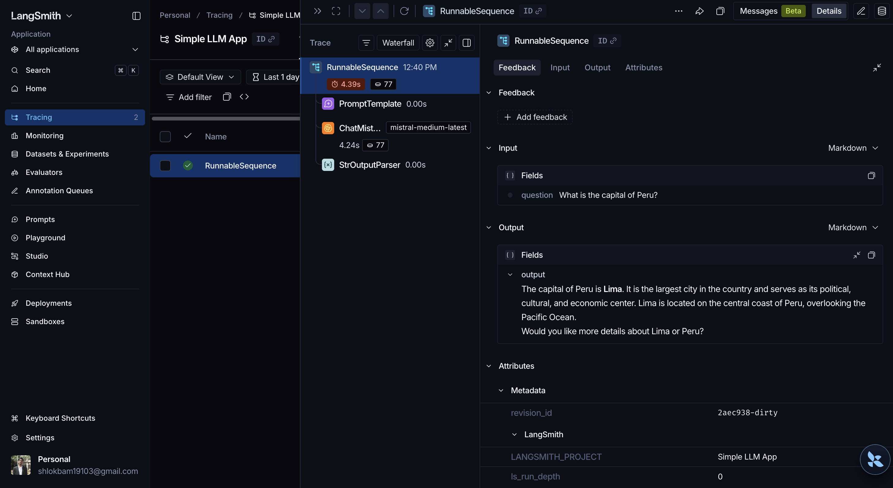

---

### 2. Sequential Chains (`2_sequential_chain.py`)
See how LangSmith automatically tracks data flowing between multiple links in a chain. This script takes a topic, generates a report, and then feeds that report into a second prompt to generate a 5-point summary.

- **Concepts**: Chain of chains (`|` operator), sequential trace nesting, configuring metadata/tags, and optimizing runtimes by using a faster model (`mistral-small-latest`).
- **Project Configuration**: Sets `os.environ['LANGSMITH_PROJECT'] = 'Sequential LLM App'` to isolate these runs.
- **Run Configuration**: Passes tags (`['sequential', 'llm']`) and metadata (`{'user': 'Shlok', 'topic': 'Unemployment in India'}`) to categorise runs inside the LangSmith UI.
- **Run**:
  ```bash
  python3 2_sequential_chain.py
  ```
- **Trace Hierarchy**:
  ```mermaid
  graph TD
      A["RunnableSequence (Chain)"] --> B["PromptTemplate (Generate Report)"]
      A --> C["ChatMistralAI (Generate Report)"]
      A --> D["StrOutputParser (Generate Report)"]
      A --> E["PromptTemplate (Summarize Report)"]
      A --> F["ChatMistralAI (Summarize Report)"]
      A --> G["StrOutputParser (Summarize Report)"]
  ```

- **LangSmith Tracing Visualization**:
  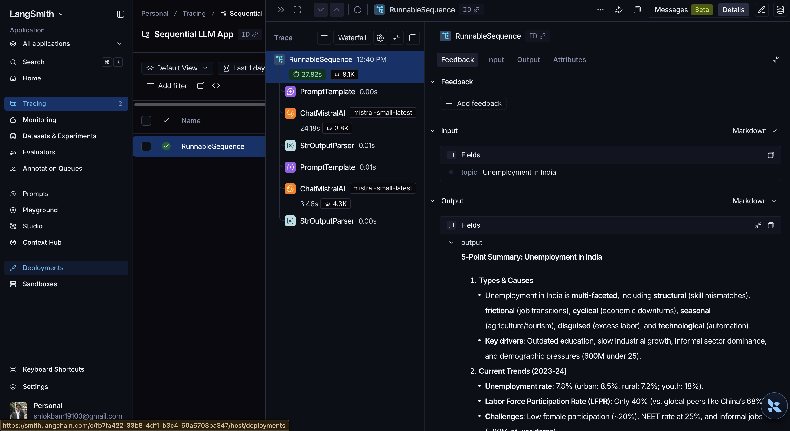

---

### 3. Retrieval-Augmented Generation (RAG) Pipeline (`3_rag_v1.py` to `3_rag_v4.py`)
In this practice series, I built a PDF-based RAG pipeline and optimized it using LangSmith tracing:

* **Version 1 (`3_rag_v1.py`)**: Basic RAG implementation using a PDF loader (`islr.pdf`), recursive character text splitting, FAISS vector store, and Mistral embeddings.
  - **Configuration**: Sets `os.environ['LANGSMITH_PROJECT'] = 'RAG App'`.
  - **LangSmith Tracing Visualization**:
    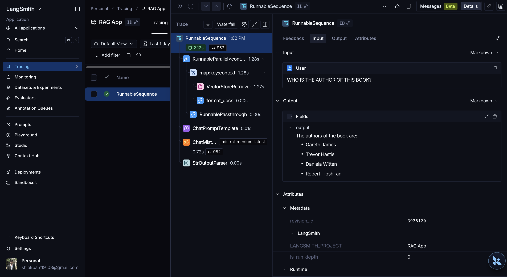
* **Version 2 (`3_rag_v2.py`)**: Introduces the `@traceable` decorator to trace custom Python functions (`load_pdf`, `split_documents`, `build_vectorstore`) that aren't natively LangChain runnables.
  - **Configuration**: Sets `os.environ['LANGSMITH_PROJECT'] = 'RAG App'` and specifies a custom `run_name: "RAG_V2"` in the run configurations.
  - **Setup Pipeline Trace (Metadata & Nested custom functions)**:
    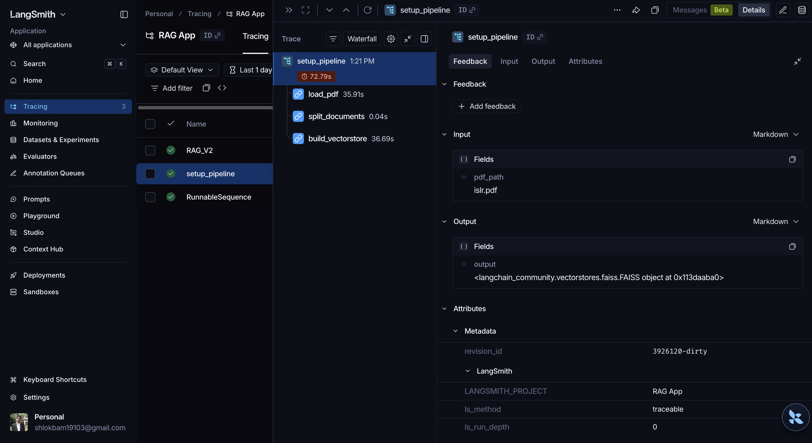
  - **Query Execution Trace (`RAG_V2`)**:
    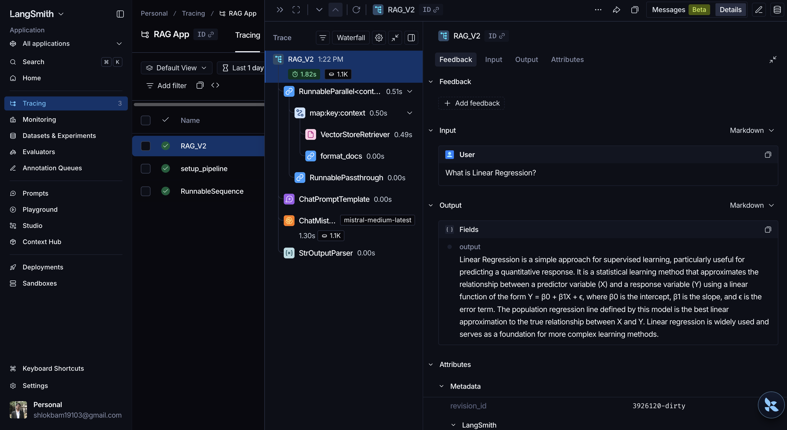
* **Version 3 (`3_rag_v3.py`)**: Creates a clean nested trace tree by wrapping the setup and run steps in a parent function decorated with `@traceable(name="pdf_rag_full_run")`.
  - **Configuration**: Sets `os.environ['LANGSMITH_PROJECT'] = 'RAG App'` and specifies a custom `run_name: "RAG_V3"` in the run configurations.
  - **LangSmith Tracing Visualization**:
    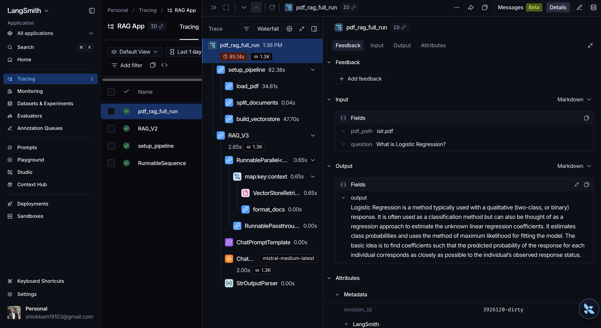
* **Version 4 (`3_rag_v4.py`)**: Adds performance caching. Instead of reloading and re-embedding the PDF every time, it computes a fingerprint of the PDF and saves/loads the FAISS index locally. LangSmith helps visualize the latency difference when cache hits occur.
  - **Configuration**: Sets `os.environ['LANGSMITH_PROJECT'] = 'RAG App'` and specifies a custom `run_name: "RAG_V4"` in the run configurations.
  - **Setup / Index Build Trace**:
    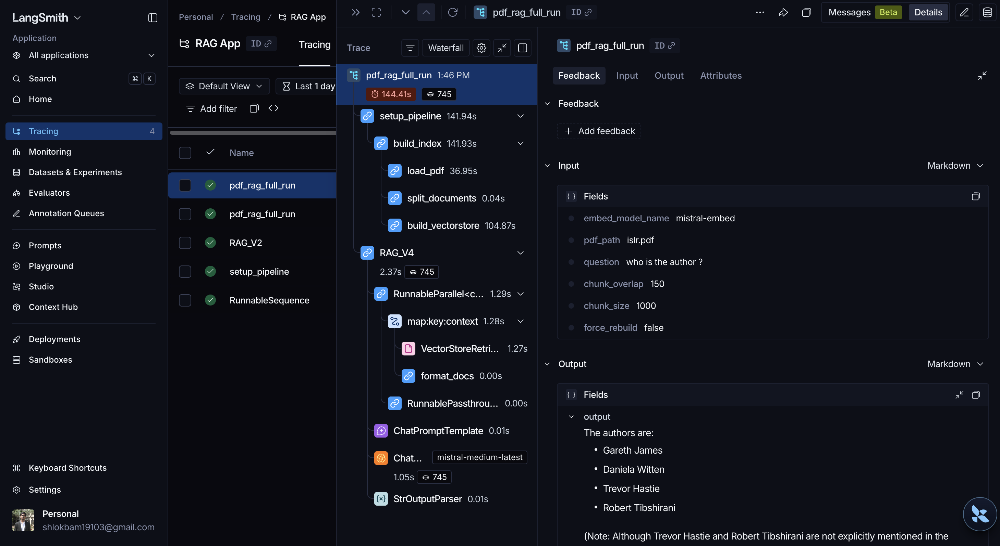
  - **Query Execution Trace (`RAG_V4`)**:
    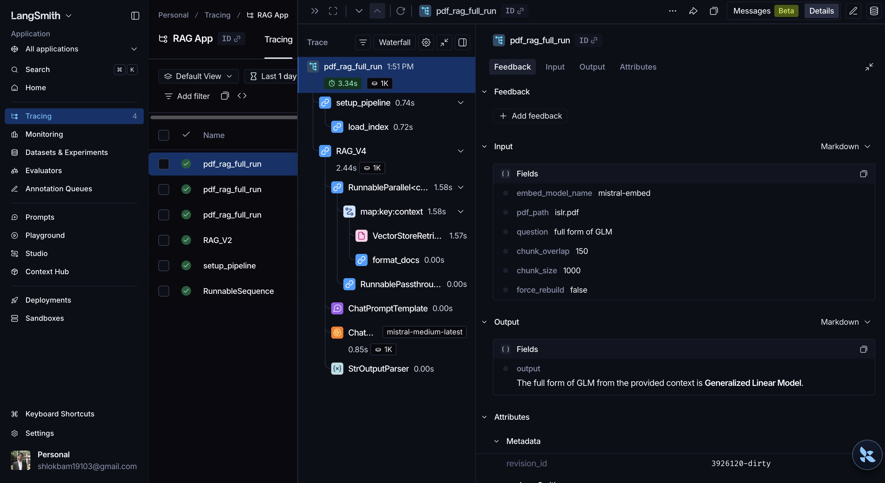

- **Concepts**: Custom `@traceable` spans, trace nesting, metadata/tags, run configuration, dynamic project routing, and selecting the correct embedding model (`mistral-embed`).
- **Project Configuration**: Sets `os.environ['LANGSMITH_PROJECT'] = 'RAG App'` to group RAG runs under one dashboard project.
- **Run**:
  ```bash
  python3 3_rag_v4.py
  ```
- **RAG V3/V4 Trace Hierarchy**:
  ```mermaid
  graph TD
      Root["pdf_rag_full_run (traceable root)"] --> Setup["setup_pipeline (setup tag)"]
      Setup --> Loader["load_pdf"]
      Setup --> Splitter["split_documents"]
      Setup --> Embed["build_vectorstore"]
      Root --> Query["pdf_rag_query (RunnableSequence)"]
      Query --> Retriever["VectorStoreRetriever"]
      Query --> Prompt["ChatPromptTemplate"]
      Query --> LLM["ChatMistralAI"]
      Query --> Parser["StrOutputParser"]
  ```
---

### 4. ReAct Agent Tracing (`4_agent.py`)
Agents are notoriously hard to debug due to their iterative reasoning loops. LangSmith shines here by laying out every step of the Agent's thought process, tools used, and intermediate results.

- **Concepts**: ReAct framework, tool tracing, LangChain Hub integration, agent loop tracing.
- **Project Configuration**: Sets `os.environ['LANGSMITH_PROJECT'] = 'ReAct Agent'` to group agent tracing runs.
- **Tools**:
  - `DuckDuckGoSearchRun`: For live web searches.
  - `get_weather_data`: Custom tool fetching weather from the Weatherstack API.
- **Run**:
  ```bash
  python3 4_agent.py
  ```
- **Agent Trace Hierarchy**:
  ```mermaid
  graph TD
      AgentExec["AgentExecutor"] --> Agent["RunnableSequence: ReAct Agent"]
      AgentExec --> ToolRun["get_weather_data / DuckDuckGoSearchRun"]
      ToolRun --> ToolReturn["Tool Output"]
      AgentExec --> FinalResponse["Final Answer"]
  ```

- **LangSmith Tracing Visualizations**:
  - *Full ReAct Loop Execution*:
    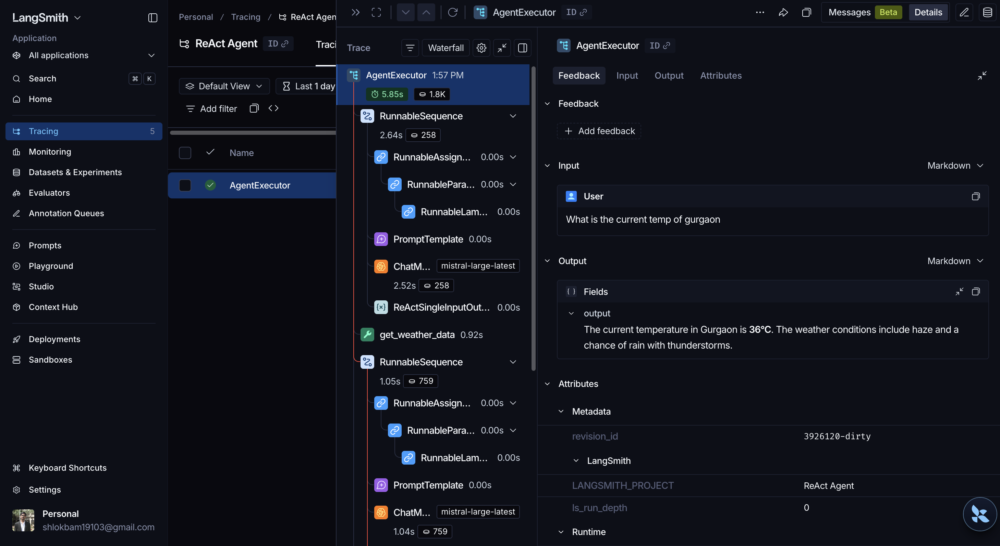
  - *Custom Tool Call Detail (`get_weather_data`)*:
    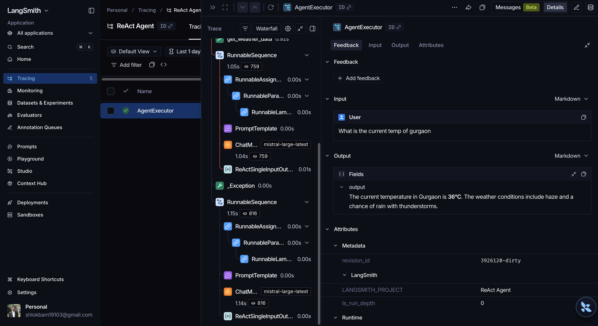

---

### 5. Multi-Agent & Parallel Workflows with LangGraph (`5_langgraph.py`)
LangGraph allows you to construct complex, stateful multi-agent workflows. This script implements an essay evaluation system that scores essays across three dimensions in parallel (fan-out), aggregates the scores (fan-in), and outputs a final grade.

- **Concepts**: Parallel node execution, fan-out/fan-in patterns, StateGraph, node-level tracing.
- **Project Configuration**: Sets `os.environ['LANGSMITH_PROJECT'] = 'LangGraph App'` to route traces to the LangGraph dashboard.
- **Run**:
  ```bash
  python3 5_langgraph.py
  ```
- **Evaluation Graph Structure**:
  ```mermaid
  stateDiagram-v2
      [*] --> START
      START --> evaluate_language : Parallel Evaluation
      START --> evaluate_analysis : Parallel Evaluation
      START --> evaluate_thought : Parallel Evaluation
      evaluate_language --> final_evaluation : Fan-in / Merge
      evaluate_analysis --> final_evaluation : Fan-in / Merge
      evaluate_thought --> final_evaluation : Fan-in / Merge
      final_evaluation --> END
      END --> [*]
  ```

- **LangSmith Tracing Visualizations**:
  - *Parallel Node Tracing (Fan-out/Fan-in)*:
    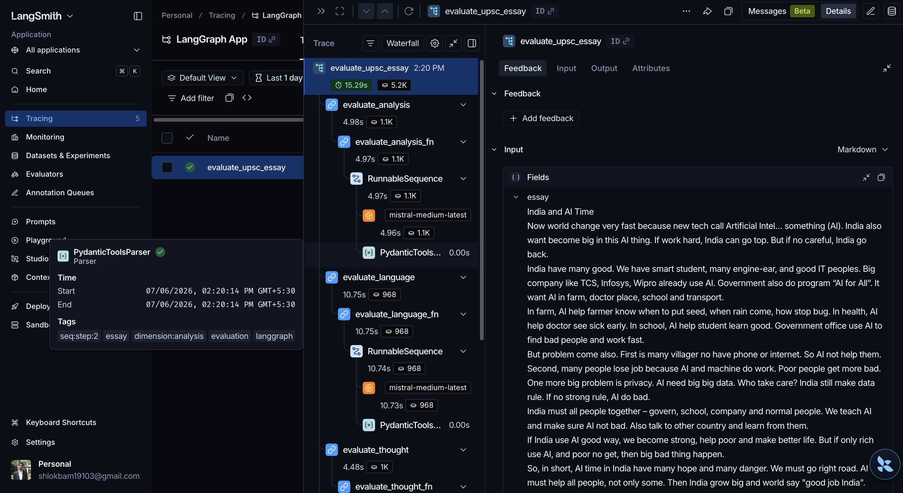
  - *Detailed Run View (Inputs, Outputs & Metadata)*:
    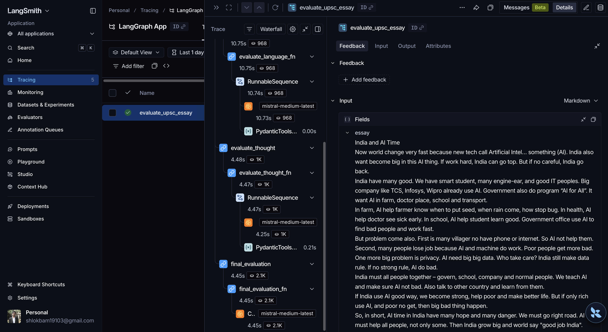

---

## 📈 Key LangSmith Concepts Explored

1. **Automatic Tracing**: Any standard LangChain runnable/chain is automatically traced just by setting env variables.
2. **Manual Tracing (`@traceable`)**: Use `@traceable` to wrap arbitrary Python functions. Useful for data preprocessing, database calls, or custom logic.
3. **Trace Nesting & Hierarchy**: Group child spans under parent functions to build readable, clean traces.
4. **Metadata & Tags**: Run configurations allow passing custom tags (e.g. `tags=["setup"]`) and metadata (e.g. `metadata={"model": "mistral-medium-latest"}`), making runs easily filterable and searchable in the LangSmith UI.
5. **Caching & Latency Analysis**: Track and compare execution times between cold runs (building vector index) and warm runs (loading cached index).

---

Happy practicing! 🕵️‍♂️
